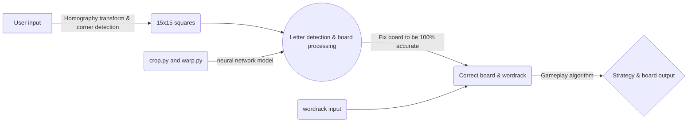

# Scrabble Solver

Scrabble score maximization from image input using corner keypoint warping and neural network letter recognition

### Authors

 - Wei Jie Lee (lweijie@umich.edu)
 - Jaehyun Shim (jaeday@umich.edu)
 - Kevin Wang (kwwangkw@umich.edu)
 - William Wang (willruiz@umich.edu)

## Files

### Training_Data

Contains data and pipeline used to train our neural network letter recognition. Having pictures of scrabble boards as our input, we have first used warp_lots.py to crop and homography transform the board into a perfect square and divide the image into 15x15 smaller squares for individual tiles. We then used crop.py to loop through the processed inputs and manually label each square as appropriate letter.

### Main

This is where our main driver of the program is. To test your own input, add your picture to sample_inputs, change line 308's pic variable to './sample_inputs/{your image name}' and simply run main.py. and follow instructions on the terminal.

Below is a simple workflow of our program:

### Visuals

### Backups

Where some of our old works are.
